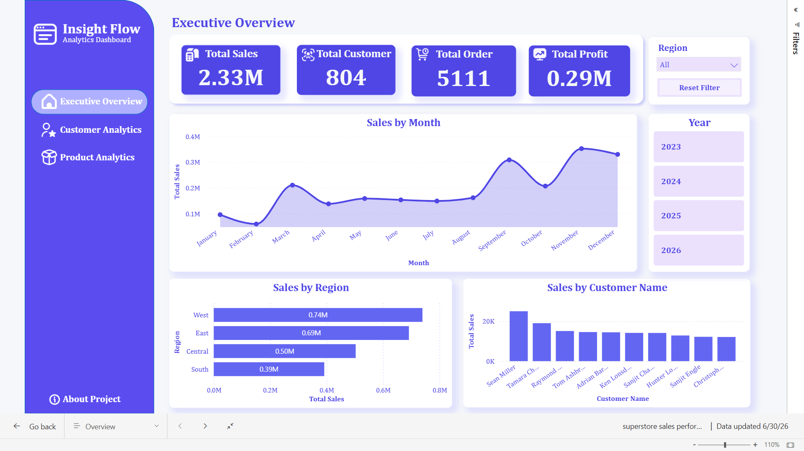
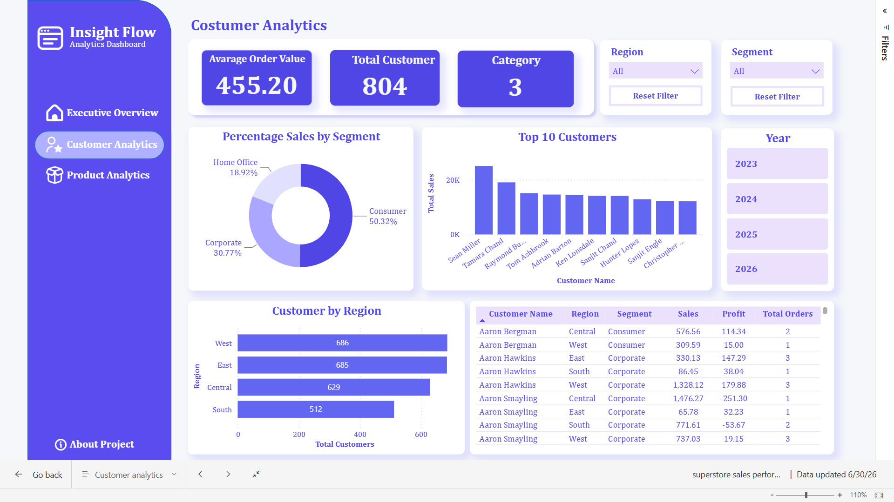
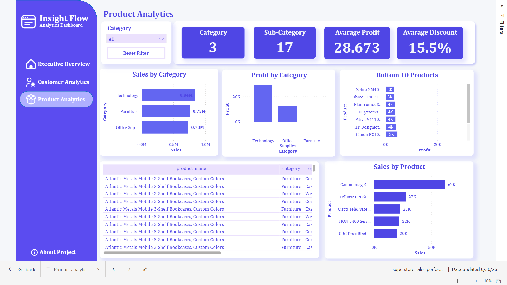

# Superstore Sales Performance Dashboard

An end-to-end Data Analytics project that demonstrates the complete analytics workflow, from data preparation and SQL analysis to interactive dashboard development using Power BI.

## Project Overview

This project analyzes retail sales performance using the Superstore Sales Dataset. The objective is to identify sales trends, evaluate regional performance, understand customer purchasing behavior, and provide business recommendations through interactive dashboards.

## Dataset

- **Dataset:** Superstore Sales Dataset
- **Source:** https://www.kaggle.com/datasets/himanshuuike/superstore-sales-dataset
- **Records:** 10,000+ Retail Sales Transactions

---

## Project Workflow

```
Business Understanding
        │
        ▼
Python Data Preparation
        │
        ▼
SQL Data Validation
        │
        ▼
SQL Data Cleaning
        │
        ▼
Exploratory Data Analysis (SQL)
        │
        ▼
Power BI Dashboard Development
        │
        ▼
Business Insights
        │
        ▼
Business Recommendations
```

---

## Technologies Used

- Python (Pandas)
- PostgreSQL
- SQL
- Power BI
- Microsoft Excel

---

## Project Structure

```
Retail-Sales-Analytics/
│
├── dataset/
│   └── samplesuperstore.csv
│
├── python/
│   └── data_preparation.ipynb
│
├── sql/
│   ├── 01_data_validation.sql
│   ├── 02_data_cleaning.sql
│   ├── 03_exploratory_data_analysis.sql
│   └── 04_business_views.sql
│
├── powerbi/
│   └── Superstore Sales Performance.pbix
│
├── dashboard/
│   ├── Executive Overview.png
│   ├── Customer Analytics.png
│   ├── Product Analytics.png
│   └── Data Quality.png
│
├── presentation/
│   └── Portfolio Presentation.pdf
│
└── README.md
```

---

# Data Preparation

### Python

- Data Inspection
- Data Cleaning
- Data Transformation
- Data Validation

### SQL

#### Data Validation

- Check Total Records
- Check Missing Values
- Check Duplicate Records
- Check Negative Sales
- Check Invalid Quantity

#### Data Cleaning

- Remove Unnecessary Spaces
- Standardize Text Format
- Convert Data Types

#### Exploratory Data Analysis

- Regional Sales Performance
- Monthly Sales Trend
- Customer Performance
- Product Performance
- Profit Margin Analysis

---

# Dashboard Pages


# Dashboard Preview

## Executive Overview

The Executive Overview provides a high-level summary of business performance through key performance indicators, sales trends, regional performance, and customer contribution.

<p align="center">
  
</p>

---

## Customer Analytics

The Customer Analytics dashboard helps analyze customer purchasing behavior, identify top-performing customers, and evaluate customer contribution across regions.

<p align="center">
  
</p>

---

## Product Analytics

The Product Analytics dashboard evaluates product categories, sub-categories, profitability, and sales performance to identify top-performing and underperforming products.

<p align="center">
  
</p>

---


Provides an overall summary of business performance through key performance indicators and sales trends.

**Key Metrics**

- Total Sales
- Total Profit
- Total Orders
- Total Customers
- Monthly Sales Trend
- Sales by Region
- Top Customers

---

### Customer Analytics

Analyze customer purchasing behavior, sales contribution, and customer performance.

---

### Product Analytics

Evaluate product categories, sub-categories, profitability, and sales performance.

---

### Data Quality

Monitor dataset quality, validation results, and data consistency before visualization.

---

# Key Insights

- Generated **2.33M** in total sales from **5,111** orders.
- Served **804** unique customers.
- The **West** region recorded the highest sales performance.
- Sales peaked during **November** following steady growth from September.
- High-value customers contributed significantly to total revenue.

---

# Business Recommendations

- Increase marketing efforts in lower-performing regions.
- Replicate successful sales strategies across all regions.
- Strengthen customer retention through loyalty programs.
- Leverage seasonal sales trends for future campaigns.
- Monitor business performance using interactive dashboards.

---

# Dashboard Preview

## Executive Overview

> *(Insert Dashboard Screenshot Here)*

## Customer Analytics

> *(Insert Dashboard Screenshot Here)*

## Product Analytics

> *(Insert Dashboard Screenshot Here)*

## Data Quality

> *(Insert Dashboard Screenshot Here)*

---

# Project Presentation

Portfolio Presentation

> *(Insert Google Drive / PDF Link Here)*

---

# Live Demo

Power BI Dashboard

> *(Insert Link Here if Available)*

---

# Author

**Anisa Nur Fitri**

LinkedIn:
https://www.linkedin.com/in/anisanurfitri/

GitHub:
https://github.com/USERNAME


## If you found this project interesting, feel free to give it a ⭐ on GitHub!
